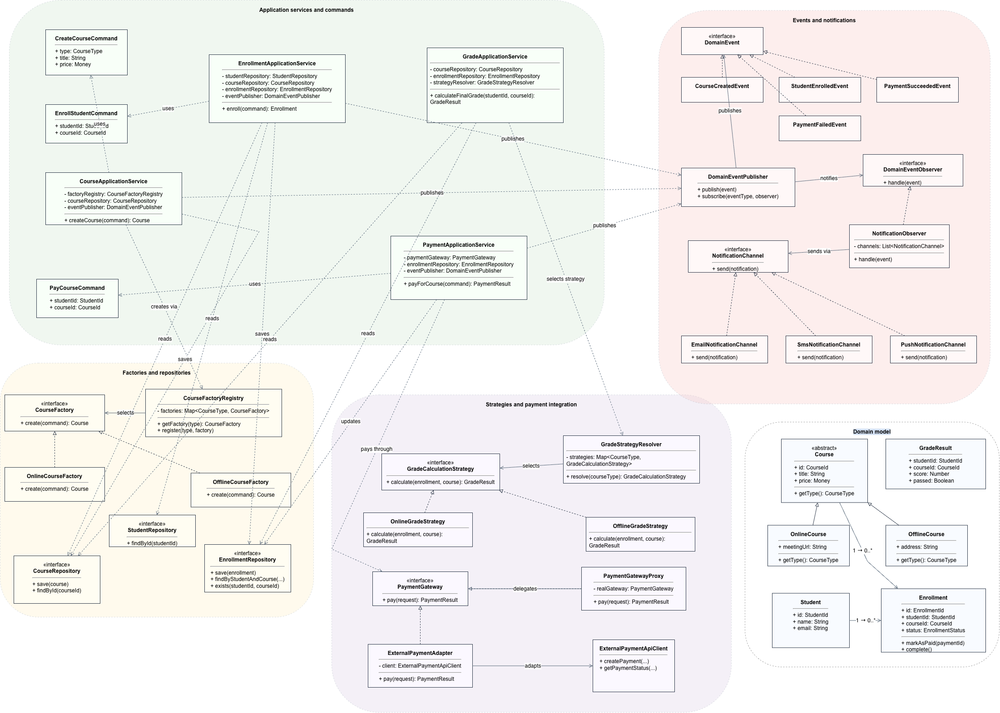

# Задание 1. Рефакторинг системы управления онлайн-курсами

## 1. Краткий анализ исходной системы

Исходная система построена вокруг одного класса `CourseManager`, который одновременно отвечает за создание курсов, хранение данных, расчет оценок, отправку уведомлений и работу с внешней платежной системой.

Такой подход приводит к нескольким архитектурным проблемам:

1. **Нарушение принципа единственной ответственности.**  
   `CourseManager` содержит разнородные обязанности: бизнес-логику, создание объектов, интеграции, уведомления и работу с данными.

2. **Нарушение принципа открытости/закрытости.**  
   Создание курсов реализовано через условные конструкции вида:

   ```text
   if (type == "online") new OnlineCourse(...)
   else if (type == "offline") new OfflineCourse(...)
   ```

   При добавлении нового типа курса нужно изменять существующий код.

3. **Жесткая фиксация алгоритма расчета оценки.**  
   Алгоритм расчета итоговой оценки находится внутри `CourseManager` и используется для всех курсов. Если для онлайн-, офлайн- или корпоративного курса нужен другой способ расчета оценки, придется изменять сам `CourseManager`.

4. **Жесткая связь бизнес-логики с уведомлениями.**  
   Вызовы `sendEmail(...)` находятся внутри бизнес-методов. Это делает бизнес-логику зависимой от конкретного канала уведомлений.

5. **Жесткая связь с внешней платежной системой.**  
   В бизнес-логике напрямую используются классы внешнего API. При замене платежного провайдера потребуется менять код бизнес-слоя.

6. **Дублирование логики.**  
   Похожие действия выполняются в разных методах `CourseManager`: проверка существования курса, проверка студента, запись состояния, отправка уведомлений, обработка ошибок.

Главная проблема исходной реализации состоит в том, что `CourseManager` стал «божественным объектом» — классом, который знает и делает слишком много. Новая архитектура должна разделить систему на независимые компоненты с четкими зонами ответственности.

---

## 2. Целевая архитектура

Предлагается разделить систему на четыре слоя:

1. **Domain layer — доменный слой.**  
   Содержит основные бизнес-сущности и доменные правила: `Course`, `Student`, `Enrollment`, `GradeResult`, `Payment`.

2. **Application layer — прикладной слой.**  
   Содержит сценарии использования системы: создание курса, регистрация студента, прохождение обучения, расчет оценки, оплата курса.

3. **Ports / Interfaces — слой абстракций.**  
   Содержит интерфейсы для работы с хранилищем, уведомлениями, платежами, расчетом оценок и созданием курсов.

4. **Infrastructure layer — инфраструктурный слой.**  
   Содержит конкретные реализации: база данных, email/SMS/push-уведомления, адаптер внешнего платежного API.

Такой подход позволяет бизнес-логике зависеть от интерфейсов, а не от конкретных технических реализаций.

---

## 3. Диаграмма классов

```mermaid
classDiagram
    class Course {
        <<abstract>>
        +id: CourseId
        +title: string
        +price: Money
        +getType() CourseType
    }

    class OnlineCourse {
        +meetingUrl: string
        +getType() CourseType
    }

    class OfflineCourse {
        +address: string
        +getType() CourseType
    }

    Course <|-- OnlineCourse
    Course <|-- OfflineCourse

    class Student {
        +id: StudentId
        +email: string
        +name: string
    }

    class Enrollment {
        +id: EnrollmentId
        +studentId: StudentId
        +courseId: CourseId
        +status: EnrollmentStatus
        +progress: Progress
    }

    class GradeResult {
        +studentId: StudentId
        +courseId: CourseId
        +score: number
        +passed: boolean
    }

    class CourseRepository {
        <<interface>>
        +save(course)
        +findById(courseId)
    }

    class StudentRepository {
        <<interface>>
        +findById(studentId)
    }

    class EnrollmentRepository {
        <<interface>>
        +save(enrollment)
        +findByStudentAndCourse(studentId, courseId)
    }

    class CourseFactory {
        <<interface>>
        +create(command) Course
    }

    class OnlineCourseFactory {
        +create(command) Course
    }

    class OfflineCourseFactory {
        +create(command) Course
    }

    CourseFactory <|.. OnlineCourseFactory
    CourseFactory <|.. OfflineCourseFactory

    class CourseFactoryRegistry {
        +getFactory(type) CourseFactory
    }

    CourseFactoryRegistry --> CourseFactory

    class GradeCalculationStrategy {
        <<interface>>
        +calculate(enrollment, course) GradeResult
    }

    class OnlineGradeStrategy {
        +calculate(enrollment, course) GradeResult
    }

    class OfflineGradeStrategy {
        +calculate(enrollment, course) GradeResult
    }

    GradeCalculationStrategy <|.. OnlineGradeStrategy
    GradeCalculationStrategy <|.. OfflineGradeStrategy

    class GradeStrategyResolver {
        +resolve(courseType) GradeCalculationStrategy
    }

    GradeStrategyResolver --> GradeCalculationStrategy

    class PaymentGateway {
        <<interface>>
        +pay(paymentRequest) PaymentResult
    }

    class ExternalPaymentAdapter {
        +pay(paymentRequest) PaymentResult
    }

    class PaymentGatewayProxy {
        +pay(paymentRequest) PaymentResult
    }

    PaymentGateway <|.. ExternalPaymentAdapter
    PaymentGateway <|.. PaymentGatewayProxy
    PaymentGatewayProxy --> ExternalPaymentAdapter

    class ExternalPaymentApiClient {
        +createPayment(...)
        +getPaymentStatus(...)
    }

    ExternalPaymentAdapter --> ExternalPaymentApiClient

    class NotificationChannel {
        <<interface>>
        +send(notification)
    }

    class EmailNotificationChannel {
        +send(notification)
    }

    class SmsNotificationChannel {
        +send(notification)
    }

    class PushNotificationChannel {
        +send(notification)
    }

    NotificationChannel <|.. EmailNotificationChannel
    NotificationChannel <|.. SmsNotificationChannel
    NotificationChannel <|.. PushNotificationChannel

    class DomainEventPublisher {
        +publish(event)
        +subscribe(eventType, observer)
    }

    class DomainEventObserver {
        <<interface>>
        +handle(event)
    }

    class NotificationObserver {
        +handle(event)
    }

    DomainEventObserver <|.. NotificationObserver
    DomainEventPublisher --> DomainEventObserver
    NotificationObserver --> NotificationChannel

    class CreateCourseCommand {
        +type: CourseType
        +title: string
        +price: Money
    }

    class EnrollStudentCommand {
        +studentId: StudentId
        +courseId: CourseId
    }

    class PayCourseCommand {
        +studentId: StudentId
        +courseId: CourseId
    }

    class CourseApplicationService {
        +createCourse(command)
    }

    class EnrollmentApplicationService {
        +enroll(command)
    }

    class GradeApplicationService {
        +calculateFinalGrade(studentId, courseId)
    }

    class PaymentApplicationService {
        +payForCourse(command)
    }

    CourseApplicationService --> CourseFactoryRegistry
    CourseApplicationService --> CourseRepository
    CourseApplicationService --> DomainEventPublisher

    EnrollmentApplicationService --> StudentRepository
    EnrollmentApplicationService --> CourseRepository
    EnrollmentApplicationService --> EnrollmentRepository
    EnrollmentApplicationService --> DomainEventPublisher

    GradeApplicationService --> CourseRepository
    GradeApplicationService --> EnrollmentRepository
    GradeApplicationService --> GradeStrategyResolver

    PaymentApplicationService --> PaymentGateway
    PaymentApplicationService --> EnrollmentRepository
    PaymentApplicationService --> DomainEventPublisher
```





---

## 4. Основные классы и их ответственность

### 4.1. Доменный слой

#### `Course`

Абстрактная сущность курса. Содержит общие свойства курса: идентификатор, название, стоимость, тип курса. Не отвечает за сохранение, оплату, уведомления или расчет оценки.

#### `OnlineCourse`

Конкретный тип курса для онлайн-обучения. Может содержать ссылку на вебинар, параметры доступа к платформе, формат онлайн-занятий.

#### `OfflineCourse`

Конкретный тип курса для очного обучения. Может содержать адрес, аудиторию, расписание очных занятий.

#### `Student`

Сущность студента. Хранит данные пользователя, необходимые для регистрации на курс и коммуникации.

#### `Enrollment`

Сущность записи студента на курс. Хранит связь между студентом и курсом, статус обучения, прогресс и результат прохождения.

#### `GradeResult`

Результат итоговой оценки: числовой балл, признак успешного прохождения, дополнительные данные о критериях оценки.

---

### 4.2. Прикладной слой

#### `CourseApplicationService`

Отвечает за сценарий создания курса. Получает команду `CreateCourseCommand`, выбирает подходящую фабрику через `CourseFactoryRegistry`, создает курс, сохраняет его через `CourseRepository` и публикует событие `CourseCreatedEvent`.

#### `EnrollmentApplicationService`

Отвечает за регистрацию студента на курс. Проверяет существование студента и курса, создает `Enrollment`, сохраняет запись и публикует событие `StudentEnrolledEvent`.

#### `GradeApplicationService`

Отвечает за расчет итоговой оценки. Получает курс и запись студента, выбирает нужную стратегию расчета через `GradeStrategyResolver`, рассчитывает итоговый результат и сохраняет его.

#### `PaymentApplicationService`

Отвечает за сценарий оплаты курса. Не знает о конкретном внешнем API. Работает только с интерфейсом `PaymentGateway`. После успешной оплаты меняет статус записи на курс и публикует событие `PaymentSucceededEvent`.

---

### 4.3. Интерфейсы и порты

#### `CourseFactory`

Интерфейс фабрики создания курса.

```text
interface CourseFactory {
    Course create(CreateCourseCommand command);
}
```

#### `CourseFactoryRegistry`

Реестр фабрик. По типу курса возвращает нужную фабрику.

```text
class CourseFactoryRegistry {
    private factories: Map<CourseType, CourseFactory>;

    CourseFactory getFactory(CourseType type) {
        if (!factories.contains(type)) {
            throw new UnsupportedCourseTypeException(type);
        }

        return factories.get(type);
    }
}
```

#### `GradeCalculationStrategy`

Интерфейс стратегии расчета оценки.

```text
interface GradeCalculationStrategy {
    GradeResult calculate(Enrollment enrollment, Course course);
}
```

#### `PaymentGateway`

Внутренний интерфейс платежного шлюза.

```text
interface PaymentGateway {
    PaymentResult pay(PaymentRequest request);
}
```

Бизнес-логика зависит от `PaymentGateway`, а не от конкретного класса внешнего платежного API.

#### `NotificationChannel`

Интерфейс канала уведомлений.

```text
interface NotificationChannel {
    void send(Notification notification);
}
```

Конкретные реализации: `EmailNotificationChannel`, `SmsNotificationChannel`, `PushNotificationChannel`.

#### `DomainEventPublisher`

Компонент публикации доменных событий. Позволяет бизнес-сценариям сообщать о важных событиях, не вызывая уведомления напрямую.

---

## 5. Используемые паттерны проектирования

В архитектуре используются следующие паттерны:

1. `Factory Method`
2. `Strategy`
3. `Observer`
4. `Adapter`
5. `Proxy`
6. `Command`

Паттернов больше четырех, так как каждая проблема системы решается отдельным архитектурным механизмом.

---

### 5.1. Factory Method

#### Где используется

Паттерн применяется в механизме создания курсов:

```text
interface CourseFactory {
    Course create(CreateCourseCommand command);
}

class OnlineCourseFactory implements CourseFactory {
    Course create(CreateCourseCommand command) {
        return new OnlineCourse(command.title, command.price, command.meetingUrl);
    }
}

class OfflineCourseFactory implements CourseFactory {
    Course create(CreateCourseCommand command) {
        return new OfflineCourse(command.title, command.price, command.address);
    }
}
```

`CourseApplicationService` не создает `OnlineCourse` или `OfflineCourse` напрямую. Он получает фабрику из `CourseFactoryRegistry`:

```text
class CourseApplicationService {
    Course createCourse(CreateCourseCommand command) {
        CourseFactory factory = courseFactoryRegistry.getFactory(command.type);
        Course course = factory.create(command);

        courseRepository.save(course);
        eventPublisher.publish(new CourseCreatedEvent(course.id));

        return course;
    }
}
```

#### Какую задачу решает

Паттерн устраняет условные конструкции `if / else` при создании курсов и убирает прямую зависимость бизнес-логики от конкретных классов `OnlineCourse`, `OfflineCourse`.

При добавлении нового типа курса, например `CorporateCourse`, нужно добавить новый класс `CorporateCourse` и новую фабрику `CorporateCourseFactory`, а затем зарегистрировать ее в `CourseFactoryRegistry`. Основной код сценария создания курса изменять не нужно.

---

### 5.2. Strategy

#### Где используется

Паттерн применяется для расчета итоговой оценки.

```text
interface GradeCalculationStrategy {
    GradeResult calculate(Enrollment enrollment, Course course);
}

class OnlineGradeStrategy implements GradeCalculationStrategy {
    GradeResult calculate(Enrollment enrollment, Course course) {
        // Например:
        // 40% — тесты
        // 40% — домашние задания
        // 20% — посещаемость онлайн-занятий
    }
}

class OfflineGradeStrategy implements GradeCalculationStrategy {
    GradeResult calculate(Enrollment enrollment, Course course) {
        // Например:
        // 50% — итоговый экзамен
        // 30% — практические задания
        // 20% — посещаемость очных занятий
    }
}
```

Выбор стратегии выполняет отдельный компонент:

```text
class GradeStrategyResolver {
    GradeCalculationStrategy resolve(CourseType type) {
        return strategies.get(type);
    }
}
```

#### Какую задачу решает

Паттерн позволяет изменять алгоритмы расчета оценки независимо от основной бизнес-логики. `GradeApplicationService` не содержит конкретной формулы расчета, а делегирует ее выбранной стратегии.

Это устраняет жесткую фиксацию одного алгоритма оценки для всех типов курсов.

---

### 5.3. Observer

#### Где используется

Паттерн применяется для обработки доменных событий и отправки уведомлений.

```text
interface DomainEventObserver {
    void handle(DomainEvent event);
}

class NotificationObserver implements DomainEventObserver {
    void handle(DomainEvent event) {
        Notification notification = notificationFactory.createFrom(event);
        notificationChannel.send(notification);
    }
}
```

Прикладной сервис публикует событие:

```text
eventPublisher.publish(new StudentEnrolledEvent(studentId, courseId));
```

Подписчик обрабатывает событие:

```text
NotificationObserver.handle(StudentEnrolledEvent event)
```

#### Какую задачу решает

Паттерн отделяет бизнес-сценарии от уведомлений. Внутри `EnrollmentApplicationService` больше нет вызова `sendEmail(...)`.

Если нужно добавить SMS, push-уведомления или уведомления в мессенджер, не нужно изменять бизнес-логику регистрации на курс. Нужно добавить новый канал уведомлений или нового подписчика на событие.

---

### 5.4. Adapter

#### Где используется

Паттерн применяется для интеграции с внешней платежной системой.

Внутренний интерфейс системы:

```text
interface PaymentGateway {
    PaymentResult pay(PaymentRequest request);
}
```

Адаптер внешнего API:

```text
class ExternalPaymentAdapter implements PaymentGateway {
    private ExternalPaymentApiClient client;

    PaymentResult pay(PaymentRequest request) {
        ExternalPaymentResponse response = client.createPayment(
            request.amount,
            request.currency,
            request.studentId,
            request.courseId
        );

        return new PaymentResult(
            response.paymentId,
            response.status,
            response.errorMessage
        );
    }
}
```

#### Какую задачу решает

Паттерн изолирует систему от конкретного внешнего платежного API. Бизнес-логика работает с интерфейсом `PaymentGateway`, а все особенности внешнего сервиса скрыты внутри `ExternalPaymentAdapter`.

Если платежный провайдер изменится, потребуется написать новый адаптер, например `AnotherPaymentProviderAdapter`, но не менять `PaymentApplicationService`.

---

### 5.5. Proxy

#### Где используется

Паттерн применяется как обертка над платежным шлюзом.

```text
class PaymentGatewayProxy implements PaymentGateway {
    private PaymentGateway realGateway;
    private Logger logger;
    private RetryPolicy retryPolicy;

    PaymentResult pay(PaymentRequest request) {
        logger.info("Payment started", request);

        PaymentResult result = retryPolicy.execute(() -> realGateway.pay(request));

        logger.info("Payment finished", result);

        return result;
    }
}
```

#### Какую задачу решает

Прокси добавляет техническое поведение вокруг платежей: логирование, повторные попытки, метрики, аудит, обработку временных ошибок внешнего сервиса.

При этом `PaymentApplicationService` не содержит технический код интеграции и не знает, есть ли перед реальным шлюзом прокси.

---

### 5.6. Command

#### Где используется

Паттерн применяется для представления прикладных операций в виде отдельных команд:

```text
class CreateCourseCommand {
    CourseType type;
    String title;
    Money price;
}

class EnrollStudentCommand {
    StudentId studentId;
    CourseId courseId;
}

class PayCourseCommand {
    StudentId studentId;
    CourseId courseId;
}
```

Прикладные сервисы принимают команды:

```text
courseApplicationService.createCourse(command);
enrollmentApplicationService.enroll(command);
paymentApplicationService.payForCourse(command);
```

#### Какую задачу решает

Паттерн упорядочивает входные данные для бизнес-сценариев и снижает дублирование. Валидация, логирование, транзакционность и обработка ошибок могут быть унифицированы на уровне команд или обработчиков команд.

Например, все команды могут проходить через общий механизм:

```text
validate(command);
beginTransaction();
execute(command);
commitTransaction();
publishEvents();
```

Это уменьшает дублирование повторяющихся действий в разных методах.

---

## 6. Псевдокод новой реализации

### 6.1. Создание курса

```text
class CourseApplicationService {
    private CourseFactoryRegistry factoryRegistry;
    private CourseRepository courseRepository;
    private DomainEventPublisher eventPublisher;

    Course createCourse(CreateCourseCommand command) {
        validate(command);

        CourseFactory factory = factoryRegistry.getFactory(command.type);
        Course course = factory.create(command);

        courseRepository.save(course);

        eventPublisher.publish(new CourseCreatedEvent(course.id));

        return course;
    }
}
```

Ключевая особенность: сервис создания курса не содержит `if / else` и не вызывает конкретные конструкторы курсов напрямую.

---

### 6.2. Регистрация студента на курс

```text
class EnrollmentApplicationService {
    private StudentRepository studentRepository;
    private CourseRepository courseRepository;
    private EnrollmentRepository enrollmentRepository;
    private DomainEventPublisher eventPublisher;

    Enrollment enroll(EnrollStudentCommand command) {
        Student student = studentRepository.findById(command.studentId);
        Course course = courseRepository.findById(command.courseId);

        if (student == null) {
            throw new StudentNotFoundException(command.studentId);
        }

        if (course == null) {
            throw new CourseNotFoundException(command.courseId);
        }

        if (enrollmentRepository.exists(command.studentId, command.courseId)) {
            throw new StudentAlreadyEnrolledException(command.studentId, command.courseId);
        }

        Enrollment enrollment = Enrollment.create(student.id, course.id);

        enrollmentRepository.save(enrollment);

        eventPublisher.publish(new StudentEnrolledEvent(student.id, course.id));

        return enrollment;
    }
}
```

Ключевая особенность: регистрация студента не содержит отправку email напрямую. Она только публикует доменное событие.

---

### 6.3. Расчет итоговой оценки

```text
class GradeApplicationService {
    private CourseRepository courseRepository;
    private EnrollmentRepository enrollmentRepository;
    private GradeStrategyResolver strategyResolver;

    GradeResult calculateFinalGrade(StudentId studentId, CourseId courseId) {
        Course course = courseRepository.findById(courseId);
        Enrollment enrollment = enrollmentRepository.findByStudentAndCourse(studentId, courseId);

        if (course == null) {
            throw new CourseNotFoundException(courseId);
        }

        if (enrollment == null) {
            throw new EnrollmentNotFoundException(studentId, courseId);
        }

        GradeCalculationStrategy strategy = strategyResolver.resolve(course.getType());

        return strategy.calculate(enrollment, course);
    }
}
```

Ключевая особенность: алгоритм оценки вынесен в стратегию и может меняться независимо от сервиса.

---

### 6.4. Оплата курса

```text
class PaymentApplicationService {
    private PaymentGateway paymentGateway;
    private EnrollmentRepository enrollmentRepository;
    private DomainEventPublisher eventPublisher;

    PaymentResult payForCourse(PayCourseCommand command) {
        Enrollment enrollment = enrollmentRepository.findByStudentAndCourse(
            command.studentId,
            command.courseId
        );

        if (enrollment == null) {
            throw new EnrollmentNotFoundException(command.studentId, command.courseId);
        }

        PaymentRequest request = PaymentRequest.from(enrollment);

        PaymentResult result = paymentGateway.pay(request);

        if (result.isSuccessful()) {
            enrollment.markAsPaid(result.paymentId);
            enrollmentRepository.save(enrollment);

            eventPublisher.publish(
                new PaymentSucceededEvent(command.studentId, command.courseId, result.paymentId)
            );
        } else {
            eventPublisher.publish(
                new PaymentFailedEvent(command.studentId, command.courseId, result.errorMessage)
            );
        }

        return result;
    }
}
```

Ключевая особенность: сервис оплаты зависит от интерфейса `PaymentGateway`, а не от конкретного внешнего API.

---

### 6.5. Уведомления через события

```text
class NotificationObserver implements DomainEventObserver {
    private List<NotificationChannel> channels;
    private NotificationFactory notificationFactory;

    void handle(DomainEvent event) {
        Notification notification = notificationFactory.createFrom(event);

        for (NotificationChannel channel : channels) {
            channel.send(notification);
        }
    }
}
```

Пример каналов:

```text
class EmailNotificationChannel implements NotificationChannel {
    void send(Notification notification) {
        emailClient.send(notification.recipient, notification.subject, notification.text);
    }
}

class SmsNotificationChannel implements NotificationChannel {
    void send(Notification notification) {
        smsClient.send(notification.phone, notification.text);
    }
}
```

Ключевая особенность: новые каналы уведомлений добавляются без изменения бизнес-сервисов.

---

## 7. Соответствие проблем и решений

| Проблема | Решение | Используемый паттерн | Обоснование |
|---|---|---|---|
| В `CourseManager` сосредоточены разные обязанности: создание курсов, хранение данных, расчет оценок, уведомления, платежи | Разделить систему на доменные сущности, прикладные сервисы, репозитории, фабрики, стратегии, адаптеры и наблюдателей | В основном разделение ответственности; дополнительно Command, Observer, Strategy, Adapter | Каждый класс получает одну понятную ответственность. Бизнес-сценарии отделяются от инфраструктуры и технических деталей |
| Создание курсов реализовано через `if / else` и прямые вызовы конструкторов | Ввести `CourseFactory`, конкретные фабрики `OnlineCourseFactory`, `OfflineCourseFactory` и `CourseFactoryRegistry` | Factory Method | Создание объектов переносится в фабрики. Добавление нового типа курса не требует изменения основного сервиса создания курса |
| При добавлении нового типа курса нужно менять существующий код | Новый тип курса добавляется через новую реализацию `CourseFactory` и регистрацию в реестре | Factory Method | Основной сценарий `createCourse()` остается закрытым для изменения, но открытым для расширения |
| Алгоритм расчета оценки жестко зафиксирован в одном методе | Ввести интерфейс `GradeCalculationStrategy` и отдельные стратегии для разных типов курсов | Strategy | Алгоритмы оценки становятся взаимозаменяемыми. Можно добавить новую стратегию без изменения `GradeApplicationService` |
| Отправка уведомлений встроена в бизнес-логику через `sendEmail(...)` | Заменить прямую отправку email на публикацию доменных событий и обработку событий подписчиками | Observer | Бизнес-сервис только сообщает о факте события. Уведомления обрабатываются отдельно |
| Добавление нового канала уведомлений требует изменения существующего кода | Ввести `NotificationChannel` и реализации `EmailNotificationChannel`, `SmsNotificationChannel`, `PushNotificationChannel` | Observer + интерфейс канала уведомлений | Новый канал добавляется как новая реализация интерфейса без изменения сценариев регистрации, оплаты или завершения курса |
| Работа с платежной системой реализована напрямую через классы внешнего API | Ввести внутренний интерфейс `PaymentGateway` и адаптер `ExternalPaymentAdapter` | Adapter | Внешний API скрыт за внутренним контрактом. При смене провайдера меняется только адаптер |
| Техническая логика платежей смешивается с бизнес-логикой: логирование, retry, аудит, обработка временных ошибок | Обернуть платежный шлюз в `PaymentGatewayProxy` | Proxy | Прокси добавляет техническое поведение вокруг платежного шлюза, не загрязняя бизнес-сервис |
| В коде присутствует дублирование действий: валидация, транзакции, обработка ошибок, публикация событий | Оформить входные сценарии как команды: `CreateCourseCommand`, `EnrollStudentCommand`, `PayCourseCommand`; общие шаги вынести в общий механизм обработки команд | Command | Команды стандартизируют входные данные и позволяют централизовать общие этапы выполнения сценариев |
| Класс `CourseManager` сложно тестировать из-за большого количества зависимостей | Зависимости заменены интерфейсами: репозитории, фабрики, стратегии, платежный шлюз, каналы уведомлений | Adapter, Strategy, Factory Method, Observer | Каждый компонент можно тестировать отдельно. В тестах можно подменять интерфейсы mock-реализациями |
| Смена платежного провайдера требует изменения бизнес-кода | Создать новый адаптер, например `NewPaymentProviderAdapter`, реализующий `PaymentGateway` | Adapter | Бизнес-сервис оплаты остается неизменным |
| Изменение правил уведомлений требует изменения бизнес-кода | Настроить новых подписчиков на события или добавить новый канал уведомлений | Observer | Реакция на событие расширяется через подписчиков, а не через изменение прикладного сервиса |

---

## 8. Как новая архитектура соблюдает DRY, KISS и разделение ответственности

### DRY

Принцип DRY соблюдается за счет устранения повторяющихся участков логики:

- повторяющееся создание курсов вынесено в фабрики;
- повторяющийся расчет оценок вынесен в стратегии;
- повторяющаяся отправка уведомлений вынесена в наблюдателей и каналы уведомлений;
- повторяющаяся работа с платежным API вынесена в адаптер;
- повторяющиеся технические операции вокруг платежей вынесены в прокси;
- повторяющиеся входные данные сценариев оформлены в команды.

### KISS

Архитектура не вводит лишних компонентов без необходимости. Каждый паттерн решает конкретную проблему:

- фабрика нужна для создания разных типов курсов;
- стратегия нужна для разных алгоритмов оценки;
- наблюдатель нужен для отвязки уведомлений от бизнес-логики;
- адаптер нужен для изоляции внешнего платежного API;
- прокси нужен для технической обертки платежей;
- команда нужна для стандартизации бизнес-сценариев.

Если в системе пока есть только один способ расчета оценки или один канал уведомлений, интерфейсы все равно оправданы, потому что само условие задачи требует возможность независимого изменения алгоритмов, уведомлений и внешнего платежного сервиса.

### Разделение ответственности

Каждый компонент отвечает за свою часть системы:

| Компонент | Ответственность |
|---|---|
| `Course` | Данные и базовое поведение курса |
| `OnlineCourse`, `OfflineCourse` | Особенности конкретных типов курсов |
| `CourseFactory` | Создание курса нужного типа |
| `CourseApplicationService` | Сценарий создания курса |
| `EnrollmentApplicationService` | Сценарий регистрации студента |
| `GradeCalculationStrategy` | Алгоритм расчета оценки |
| `GradeApplicationService` | Координация расчета итоговой оценки |
| `PaymentGateway` | Внутренний контракт оплаты |
| `ExternalPaymentAdapter` | Преобразование внутреннего платежного запроса во внешний API |
| `PaymentGatewayProxy` | Логирование, retry, аудит и метрики платежей |
| `DomainEventPublisher` | Публикация событий |
| `NotificationObserver` | Реакция на события и отправка уведомлений |
| `NotificationChannel` | Отправка уведомлений через конкретный канал |
| `Repository`-интерфейсы | Работа с хранилищем без привязки к конкретной БД |

---

## 9. Пример добавления нового типа курса

Допустим, нужно добавить новый тип курса — `CorporateCourse`.

В старой архитектуре пришлось бы менять `CourseManager`:

```text
if (type == "corporate") new CorporateCourse(...)
```

В новой архитектуре нужно добавить новый класс и новую фабрику:

```text
class CorporateCourse extends Course {
    CompanyId companyId;
    Integer maxEmployees;
}

class CorporateCourseFactory implements CourseFactory {
    Course create(CreateCourseCommand command) {
        return new CorporateCourse(
            command.title,
            command.price,
            command.companyId,
            command.maxEmployees
        );
    }
}
```

Затем фабрика регистрируется в `CourseFactoryRegistry`:

```text
registry.register(CourseType.CORPORATE, new CorporateCourseFactory());
```

Основной код `CourseApplicationService` не меняется.

---

## 10. Пример замены платежного провайдера

В старой архитектуре код внешнего API был бы встроен в `CourseManager`.

В новой архитектуре бизнес-слой зависит только от интерфейса:

```text
interface PaymentGateway {
    PaymentResult pay(PaymentRequest request);
}
```

Для нового провайдера создается новый адаптер:

```text
class NewPaymentProviderAdapter implements PaymentGateway {
    private NewPaymentProviderClient client;

    PaymentResult pay(PaymentRequest request) {
        NewProviderResponse response = client.charge(...);

        return mapToPaymentResult(response);
    }
}
```

`PaymentApplicationService` остается без изменений.

---

## 11. Итоговый вывод

В исходной системе класс `CourseManager` нарушал разделение ответственности и объединял бизнес-логику, создание объектов, уведомления, платежи и работу с данными. Это делало систему сложной для расширения, тестирования и сопровождения.

Предложенная архитектура разделяет систему на независимые компоненты:

- создание курсов вынесено в фабрики;
- расчет оценок вынесен в стратегии;
- уведомления реализованы через события и наблюдателей;
- платежная система изолирована через адаптер;
- техническая логика платежей вынесена в прокси;
- входные сценарии оформлены через команды;
- хранение данных скрыто за репозиториями.

Использование паттернов `Factory Method`, `Strategy`, `Observer`, `Adapter`, `Proxy` и `Command` позволяет устранить основные проблемы исходной реализации и сделать систему более расширяемой, тестируемой и поддерживаемой.

Новая структура соответствует принципам DRY, KISS и разделения ответственности: каждый компонент выполняет свою задачу, бизнес-логика не зависит от внешних сервисов напрямую, а новые типы курсов, алгоритмы оценки, платежные провайдеры и каналы уведомлений могут добавляться без изменения центральных бизнес-сценариев.
