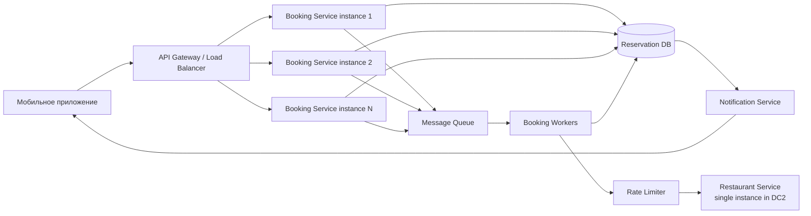

# Задание 2. Анализ архитектуры системы бронирования ресторанов

## 1. Краткое описание исходной архитектуры

Система состоит из двух микросервисов:

1. **Сервис бронирований**  
   Принимает запросы от мобильного приложения и создает бронь.

2. **Сервис ресторанов**  
   Хранит информацию о ресторанах и свободных столиках.

Текущий процесс бронирования устроен синхронно:

```text
Мобильное приложение
        |
        v
Сервис бронирований
        |
        | синхронный REST-вызов
        v
Сервис ресторанов
```

При каждом бронировании сервис бронирований делает синхронный REST-запрос в сервис ресторанов, чтобы проверить доступность столика и занять его. Если вызов в сервис ресторанов завершается ошибкой или таймаутом, пользовательский запрос тоже завершается ошибкой.

Особенности нагрузки:

- обычная нагрузка: **100 запросов в секунду**;
- пиковая нагрузка после публикации знаменитости: **50 000 запросов в секунду**;
- длительность пика: **10–15 минут**;
- после пика нагрузка возвращается к нормальному уровню;
- пиковые моменты невозможно предсказать;
- отказывать пользователям в бронировании бизнес запрещает;
- бронирование не обязано выполняться мгновенно, заявка может быть обработана в течение **24 часов**;
- сервис ресторанов существует только в одном экземпляре в ДЦ2, масштабировать его нельзя;
- сервис бронирований можно масштабировать в ДЦ1 без ограничений.

---

## 2. Центральная проблема №1: некорректная балансировка нагрузки между экземплярами сервиса бронирований

### 2.1. В чем проблема

Мобильное приложение знает адреса всех экземпляров сервиса бронирований. Эти адреса зашиты в коде приложения в одном и том же порядке у всех пользователей.

Алгоритм клиента:

```text
1. Взять первый IP-адрес из списка.
2. Отправить запрос на него.
3. Если сервис недоступен, перейти ко второму IP-адресу.
4. Если второй недоступен, перейти к третьему.
5. Если все недоступны, начать сначала.
```

Из-за этого при пиковой нагрузке все пользователи сначала идут в один и тот же первый экземпляр сервиса бронирований. Он получает непропорционально большую нагрузку и падает. После этого весь поток переходит на второй экземпляр, затем на третий и так далее.

Это не балансировка нагрузки, а последовательное добивание экземпляров.

Фактически система ведет себя так:

```text
50 000 RPS
    |
    v
[Booking-1]  падает
    |
    v
[Booking-2]  падает
    |
    v
[Booking-3]  падает
    |
    v
[Booking-N]  падает
```

Даже если в ДЦ1 запущено много экземпляров сервиса бронирований, они не используются равномерно.

### 2.2. Почему это критично

Главная проблема не только в недостаточном количестве экземпляров. Проблема в том, что запросы распределяются неправильно.

Если запустить дополнительные экземпляры сервиса бронирований, но оставить текущую клиентскую логику, это не решит проблему. Все клиенты по-прежнему будут начинать с первого IP-адреса и создавать каскадное падение.

Такая архитектура нарушает базовый принцип построения высоконагруженных систем: клиент не должен самостоятельно выполнять примитивную балансировку по фиксированному списку адресов.

### 2.3. Решение

Нужно убрать из мобильного приложения знание о конкретных экземплярах сервиса бронирований и ввести единую точку входа:

```text
Мобильное приложение
        |
        v
API Gateway / Load Balancer
        |
        +------------+------------+------------+
        |            |            |            |
        v            v            v            v
Booking-1    Booking-2    Booking-3    Booking-N
```

Возможные варианты реализации:

1. **L7 Load Balancer / API Gateway**
   - например, Nginx, HAProxy, Envoy, cloud load balancer;
   - мобильное приложение обращается к одному домену, например `api.company.com`;
   - балансировщик распределяет запросы между доступными экземплярами сервиса бронирований.

2. **DNS + балансировщик**
   - клиент знает только доменное имя;
   - за доменом находится балансировщик;
   - IP-адреса конкретных инстансов не зашиваются в приложение.

3. **Service Discovery**
   - экземпляры сервиса регистрируются в системе обнаружения сервисов;
   - балансировщик или gateway получает актуальный список живых инстансов;
   - недоступные экземпляры автоматически исключаются из ротации.

4. **Автоматическое масштабирование сервиса бронирований**
   - при росте входящей нагрузки в ДЦ1 можно поднимать дополнительные экземпляры сервиса бронирований;
   - балансировщик должен автоматически начинать направлять на них трафик.

### 2.4. Что важно учесть

Балансировщик должен поддерживать:

- равномерное распределение нагрузки;
- health checks;
- исключение недоступных экземпляров;
- rate limiting на входе;
- таймауты;
- защиту от перегрузки;
- метрики по каждому экземпляру;
- возможность горизонтального масштабирования.

При этом мобильное приложение должно работать только с одним стабильным адресом API.

---

## 3. Центральная проблема №2: синхронная зависимость от единственного сервиса ресторанов без очереди и выравнивания нагрузки

### 3.1. В чем проблема

Сервис бронирований при каждом запросе синхронно вызывает сервис ресторанов по REST.

Текущий поток обработки:

```text
Пользовательский запрос
        |
        v
Сервис бронирований
        |
        | REST-запрос
        v
Сервис ресторанов
        |
        v
Ответ пользователю
```

Проблема состоит в том, что сервис ресторанов:

- находится в другом дата-центре;
- работает в единственном экземпляре;
- не может быть масштабирован;
- не способен обработать 50 000 запросов в секунду;
- является обязательной синхронной зависимостью для каждого пользовательского запроса.

Даже если сервис бронирований выдержит входящую нагрузку, он начнет проксировать огромный поток запросов в сервис ресторанов. В результате сервис ресторанов будет перегружен и упадет.

Иначе говоря, текущая архитектура не изолирует слабую зависимость. Она передает весь пик нагрузки дальше.

### 3.2. Почему это критично

Синхронный REST-вызов превращает отказ или замедление сервиса ресторанов в отказ всей системы бронирования.

Если сервис ресторанов отвечает медленно, у сервиса бронирований начинают накапливаться ожидающие соединения, потоки или async-задачи. Это приводит к:

- росту времени ответа;
- таймаутам;
- исчерпанию connection pool;
- исчерпанию worker pool;
- повторным запросам от клиентов;
- дополнительному росту нагрузки;
- каскадному отказу.

В условиях задачи сервис ресторанов невозможно масштабировать, поэтому нельзя решать проблему прямым горизонтальным масштабированием этого сервиса.

Также важно, что бизнес-разрешение позволяет обрабатывать заявку в течение 24 часов. Значит, синхронная обработка не нужна. Система может принимать заявку быстро, сохранять ее надежно и обрабатывать позже.

### 3.3. Решение

Нужно заменить синхронную обработку бронирования на асинхронную модель с очередью и контролируемой скоростью обработки.

Новая схема:

```text
Мобильное приложение
        |
        v
API Gateway / Load Balancer
        |
        v
Сервис бронирований
        |
        | быстро сохранить заявку
        v
Очередь заявок / Message Broker
        |
        | обработка с ограниченной скоростью
        v
Booking Worker
        |
        | REST-вызов с rate limit
        v
Сервис ресторанов
```

Пользовательский запрос больше не должен ждать синхронного ответа от сервиса ресторанов.

Вместо этого сервис бронирований должен:

1. принять заявку;
2. сохранить ее в надежное хранилище;
3. положить задачу в очередь;
4. вернуть пользователю ответ, что заявка принята в обработку.

Например:

```text
HTTP/1.1 202 Accepted

{
  "reservationRequestId": "req-123",
  "status": "PENDING",
  "message": "Заявка на бронирование принята и будет обработана в течение 24 часов"
}
```

Дальше отдельные воркеры постепенно обрабатывают очередь и вызывают сервис ресторанов с безопасной скоростью.

### 3.4. Почему очередь решает проблему

Очередь выполняет роль буфера между резким пользовательским пиком и слабым сервисом ресторанов.

При пике:

```text
50 000 RPS в течение 10-15 минут
        |
        v
Очередь быстро накапливает заявки
        |
        v
Воркеры равномерно обрабатывают их в течение дня
```

Если пик длится 15 минут, количество заявок составит:

```text
50 000 запросов/сек × 900 секунд = 45 000 000 заявок
```

Так как по условию заявку можно обработать в течение 24 часов, нет необходимости отправлять все 45 миллионов запросов в сервис ресторанов немедленно. Их нужно обработать постепенно, с ограничением скорости.

Аналитики установили, что если нагрузка на сервис ресторанов будет примерно равномерной в течение дня, он спокойно обработает все запросы и будет использовать только около 20% своих максимальных мощностей. Значит, архитектурно правильное решение — не наращивать нагрузку на сервис ресторанов во время пика, а выровнять ее во времени.

### 3.5. Компоненты целевой асинхронной архитектуры

#### 1. Сервис бронирований

Отвечает за прием заявок.

Его задачи:

- принять HTTP-запрос от пользователя;
- выполнить минимальную валидацию;
- создать запись заявки со статусом `PENDING`;
- записать заявку в БД;
- опубликовать сообщение в очередь;
- вернуть пользователю `202 Accepted`.

Сервис бронирований не должен синхронно вызывать сервис ресторанов в пользовательском запросе.

#### 2. База заявок на бронирование

Хранит состояние заявки:

```text
PENDING      — заявка принята;
PROCESSING   — заявка обрабатывается;
CONFIRMED    — бронь успешно создана;
FAILED_RETRY — временная ошибка, будет повторная попытка;
FAILED_FINAL — финальная ошибка, если обработка невозможна.
```

В условиях задачи свободные столики всегда есть, поэтому бизнесовый отказ из-за отсутствия мест не ожидается. Однако технические ошибки все равно нужно учитывать: таймаут, временная недоступность сервиса ресторанов, сетевые ошибки.

#### 3. Очередь сообщений

Например:

- Kafka;
- RabbitMQ;
- AWS SQS;
- Google Pub/Sub;
- Redis Streams;
- NATS JetStream.

Очередь должна быть устойчивой и поддерживать:

- надежное хранение сообщений;
- повторные попытки;
- dead letter queue;
- контроль скорости потребления;
- мониторинг глубины очереди.

#### 4. Booking Worker

Отдельный процесс или сервис, который читает заявки из очереди и вызывает сервис ресторанов.

Его задачи:

- брать заявку из очереди;
- вызывать сервис ресторанов;
- соблюдать rate limit;
- обновлять статус заявки;
- выполнять retry при временных ошибках;
- не создавать дубликаты бронирований.

#### 5. Rate limiter

Ограничивает поток запросов в сервис ресторанов.

Так как сервис ресторанов нельзя масштабировать, нужно явно задать безопасную скорость обращений к нему. Например:

```text
не более X запросов в секунду в сервис ресторанов
```

Значение `X` должно быть рассчитано по фактической пропускной способности сервиса ресторанов.

#### 6. Идемпотентность

Так как очередь и повторные попытки могут привести к повторной обработке одного сообщения, операции должны быть идемпотентными.

Для этого у заявки должен быть уникальный идентификатор:

```text
reservationRequestId
```

При повторной обработке система должна понимать, что заявка уже была подтверждена, и не создавать дубликат.

---

## 4. Целевая архитектура



В этой архитектуре:

- мобильное приложение больше не знает адреса отдельных экземпляров сервиса бронирований;
- входящая нагрузка распределяется через балансировщик;
- сервис бронирований быстро принимает заявку и возвращает `202 Accepted`;
- пиковая нагрузка не передается напрямую в сервис ресторанов;
- очередь сглаживает всплески;
- воркеры вызывают сервис ресторанов равномерно;
- rate limiter защищает сервис ресторанов от перегрузки;
- состояние заявки хранится в БД;
- пользователь может получить статус заявки через отдельный endpoint или уведомление.

---

## 5. Новый пользовательский сценарий

### 5.1. Создание заявки

```text
POST /reservations
```

Ответ:

```json
{
  "reservationRequestId": "req-123",
  "status": "PENDING",
  "message": "Заявка принята и будет обработана в течение 24 часов"
}
```

### 5.2. Проверка статуса заявки

```text
GET /reservations/req-123
```

Возможные ответы:

```json
{
  "reservationRequestId": "req-123",
  "status": "PENDING"
}
```

```json
{
  "reservationRequestId": "req-123",
  "status": "CONFIRMED",
  "restaurantId": "restaurant-1",
  "tableId": "table-42"
}
```

### 5.3. Обработка заявки воркером

```text
1. Worker берет сообщение из очереди.
2. Проверяет, не была ли заявка уже обработана.
3. Ставит статус PROCESSING.
4. Через rate limiter вызывает сервис ресторанов.
5. При успехе ставит CONFIRMED.
6. При временной ошибке ставит FAILED_RETRY и возвращает задачу в очередь.
7. При исчерпании попыток переносит сообщение в Dead Letter Queue.
```

---

## 6. Таблица проблем и решений

| Центральная проблема | Почему возникает | Решение | Что дает решение |
|---|---|---|---|
| Некорректная балансировка нагрузки между экземплярами сервиса бронирований | Мобильное приложение хранит список IP-адресов в одном порядке у всех пользователей и всегда начинает с первого адреса | Ввести API Gateway / Load Balancer. Мобильное приложение должно обращаться к одному домену, а не к конкретным экземплярам сервиса | Запросы распределяются равномерно. Падение одного экземпляра не приводит к последовательному падению остальных. Можно эффективно использовать горизонтальное масштабирование |
| Синхронная зависимость от единственного сервиса ресторанов | Каждый пользовательский запрос в сервис бронирований синхронно вызывает сервис ресторанов. Пиковая нагрузка напрямую передается в сервис ресторанов | Перейти на асинхронную обработку через очередь, persistent storage, воркеры и rate limiter | Сервис бронирований быстро принимает заявки, а сервис ресторанов получает равномерную контролируемую нагрузку. Пики сглаживаются во времени, заявки обрабатываются в течение допустимых 24 часов |

---

## 7. Дополнительные архитектурные меры

### 7.1. Circuit Breaker

Для вызова сервиса ресторанов из воркеров следует использовать circuit breaker.

Если сервис ресторанов начинает отвечать ошибками или таймаутами, circuit breaker временно прекращает вызовы, чтобы не добивать зависимость. Через заданное время он может перейти в полуоткрытое состояние и проверить восстановление сервиса.

Это не заменяет очередь, но повышает устойчивость системы.

### 7.2. Retry с backoff

При временных ошибках нужно выполнять повторные попытки не сразу, а с задержкой:

```text
1-я попытка: сразу
2-я попытка: через 1 минуту
3-я попытка: через 5 минут
4-я попытка: через 15 минут
```

Это защищает сервис ресторанов от лавины повторных запросов.

### 7.3. Dead Letter Queue

Если заявка не может быть обработана после нескольких технических попыток, сообщение нужно отправлять в Dead Letter Queue.

Это позволит:

- не терять проблемные заявки;
- не блокировать основную очередь;
- разбирать технические сбои отдельно.

### 7.4. Outbox pattern

Чтобы не потерять заявку между записью в БД и публикацией сообщения в очередь, можно использовать паттерн Transactional Outbox.

Суть:

1. заявка и событие на обработку записываются в одну БД-транзакцию;
2. отдельный outbox-publisher читает события из outbox-таблицы;
3. затем публикует их в очередь.

Это устраняет риск ситуации, когда заявка сохранена, но сообщение в очередь не попало.

### 7.5. Мониторинг

Нужно отслеживать:

- количество входящих заявок в секунду;
- глубину очереди;
- время ожидания заявки в очереди;
- скорость обработки воркеров;
- процент успешных обработок;
- количество retry;
- количество сообщений в Dead Letter Queue;
- latency сервиса ресторанов;
- error rate сервиса ресторанов;
- utilization сервиса ресторанов.

Главная бизнес-метрика: заявка должна быть обработана не позднее 24 часов.

---

## 8. Почему нельзя просто увеличить количество экземпляров сервиса бронирований

Увеличение числа экземпляров сервиса бронирований решает только часть проблемы и только при наличии нормальной балансировки.

Но даже если сервис бронирований будет выдерживать 50 000 RPS, он начнет синхронно отправлять эти 50 000 RPS в сервис ресторанов. Сервис ресторанов работает в одном экземпляре и не выдержит такой поток.

Поэтому требуется не только горизонтальное масштабирование сервиса бронирований, но и изменение модели взаимодействия:

```text
было: синхронный REST-вызов при каждом пользовательском запросе;

должно стать: асинхронная заявка + очередь + контролируемая обработка.
```

---

## 9. Итоговый вывод

В исходной архитектуре есть две центральные проблемы.

Первая проблема — неправильная балансировка нагрузки на сервис бронирований. Мобильное приложение хранит список IP-адресов экземпляров в фиксированном порядке и направляет запросы сначала на первый экземпляр. При пике это приводит к последовательному падению всех экземпляров. Решение — ввести API Gateway или Load Balancer, чтобы мобильное приложение обращалось к единому адресу, а распределение нагрузки выполнялось на стороне инфраструктуры.

Вторая проблема — синхронная зависимость от единственного сервиса ресторанов. Сервис бронирований при каждом запросе синхронно вызывает сервис ресторанов. При пике вся нагрузка передается в сервис, который невозможно масштабировать. Решение — заменить синхронную обработку на асинхронную модель: принимать заявки, сохранять их, помещать в очередь и обрабатывать воркерами с контролируемой скоростью через rate limiter.

Такая архитектура соответствует условиям задачи: пользователям не отказывают в бронировании, заявки принимаются даже во время пика, сервис ресторанов защищен от перегрузки, а обработка может быть равномерно распределена в пределах допустимых 24 часов.
